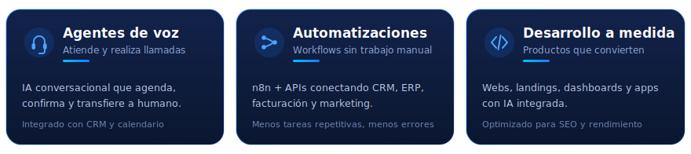
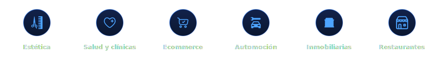

  

    

  
  
  
  
  

 

  <strong>Consultoría e implementación de IA para empresas</strong> 
  Diseñamos e implementamos soluciones de inteligencia artificial que se integran en procesos reales, 
  con equipos que las adoptan y métricas que demuestran el impacto.

  <em>Haz del futuro tu ventaja. Hoy.</em>

  
  
  
  

  

## Qué hacemos

Desde Barcelona trabajamos con **pymes, scale-ups y grupos empresariales** en toda España.
Empezamos escuchando cómo trabajáis — no proponemos nada hasta entender vuestro caso.

  

 

| Servicio | Qué resuelve | Detalle |
| --- | --- | --- |
| **[Agentes de voz](https://converly.es/agentes-de-voz)** | IA conversacional por teléfono que responde, agenda, confirma reservas y transfiere a humano. | Integrado con CRM y calendario |
| **[Automatizaciones](https://converly.es/automatizaciones)** | Workflows con n8n y APIs que eliminan el trabajo manual entre sistemas. | Facturación, cobros, onboarding, sync de datos |
| **[Desarrollo a medida](https://converly.es/desarrollo)** | Webs, landings, dashboards y apps optimizadas para SEO, rendimiento y conversión. | Con integración nativa de IA |
| **Agentes IA** | Chatbots y copilotos que resuelven consultas, generan leads y ejecutan tareas. | Con contexto de negocio |
| **Entrenamiento de IA** | Formación práctica para equipos: prompting, casos de uso, gobernanza y adopción. | Comercial, operaciones y dirección |

  

## Sectores

Adaptamos cada solución al volumen de operaciones, el stack y los objetivos de cada negocio.

  

  Estética · Salud y odontología · Ecommerce · Automoción · Inmobiliarias y hoteles · Restaurantes y negocios locales

## Cómo trabajamos

1. **Diagnóstico y demo** — entendemos el proceso, priorizamos por impacto y medimos el potencial.
2. **Alcance y KPIs** — definimos qué significa el éxito para el negocio.
3. **Despliegue** — implementación en 1–4 semanas según complejidad, integrada con tus sistemas.
4. **Acompañamiento** — formación, monitorización y optimización continua.

### ¿Por qué Converly y no otra empresa?

No somos una lista de funciones: somos un equipo que **diagnostica, prioriza y se queda contigo hasta que funciona** en tu día a día.

| | |
| --- | --- |
| **Diagnóstico antes de construir** | Primero auditamos y te damos un plan con plazos y ahorro estimado. |
| **Hecho para PYMEs reales** | Conectamos lo que ya usas — facturación, correo, hojas de cálculo, CRM — sin cambiar de herramientas. |
| **Resultados en semanas** | Empezamos por victorias rápidas; las primeras automatizaciones suelen estar listas entre la semana 3 y la 6. |
| **Seguridad desde el diseño** | Revisamos accesos, riesgos y cumplimiento antes de implementar. |

> La tecnología debe ayudar, simplificar y hacer crecer a las empresas.
> Creamos soluciones fiables, útiles y pensadas para necesidades reales.

  

## Stack y expertise

Trabajamos con el stack que ya usas — y con el que hace falta para que la IA funcione en producción.

  
  
  
  
  
  
  
  
  
  
  
  
  

**Integramos con las herramientas que ya usas:**

  
  
  
  
  
  
  
  
  
  

**Áreas:** agentes conversacionales · automatización de procesos · desarrollo web/producto · formación y adopción de IA

  

## Equipo

| | Rol | LinkedIn |
| --- | --- | --- |
| **Albert Fernández** | CEO & Fundador | [in/albert-fernández](https://www.linkedin.com/in/albert-fern%C3%A1ndez-d%C3%ADaz-37208a352) |
| **Marc Cabrera** | CTO & Co-fundador | [in/marc-cabrera-marin](https://www.linkedin.com/in/marc-cabrera-marin-bb13901ba/) |
| **Anna Duch** | Coordinadora de Marketing | [in/anna-duch-segarra](https://www.linkedin.com/in/anna-duch-segarra/) |
| **Carlos C.** | IA Agéntica · siempre disponible | — |

## Contacto

| | |
| --- | --- |
| 🌐 Web | [converly.es](https://converly.es) |
| 💬 Consulta / demo | [Solicitar consulta](https://converly.es/precios/contacto) |
| 🛠 Soporte | [converly.es/support](https://converly.es/support) |
| 📧 Email | [hola@converly.es](mailto:hola@converly.es) |
| 📞 Teléfono | [+34 936 941 330](tel:+34936941330) |
| 📍 Ubicación | Sant Joan Despí, Barcelona, España |
| 💼 LinkedIn | [company/converly-es](https://www.linkedin.com/company/converly-es) |
| 📸 Instagram | [@theconverly](https://www.instagram.com/theconverly) |
| 🎵 TikTok | [@converly](https://www.tiktok.com/@converly) |

 

  

  

    <strong>Converly</strong> · Soluciones de inteligencia artificial para hacer crecer tu empresa
  

  

    <a href="https://converly.es">converly.es</a>
    ·
    Primera auditoría gratuita · Respuesta en menos de 24 h
  

